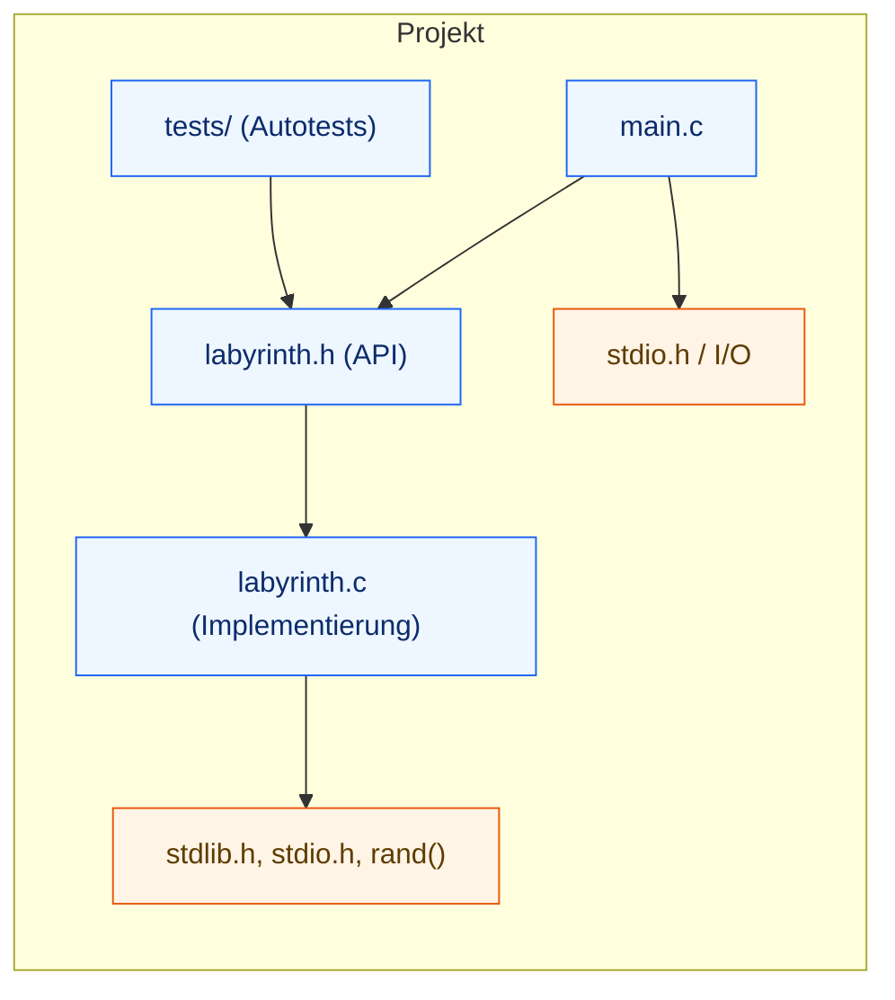
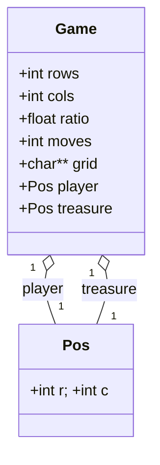
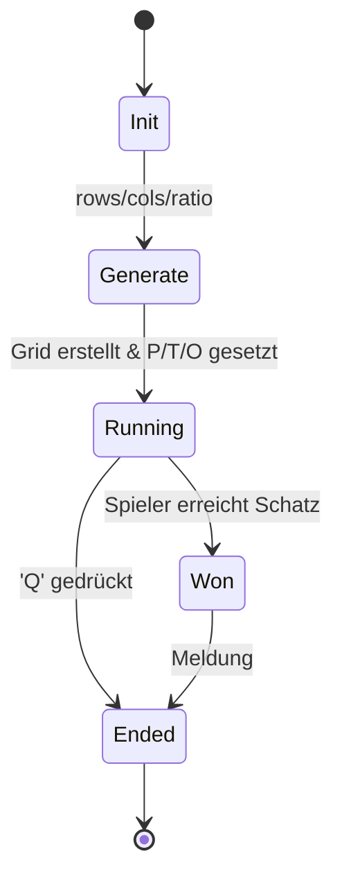
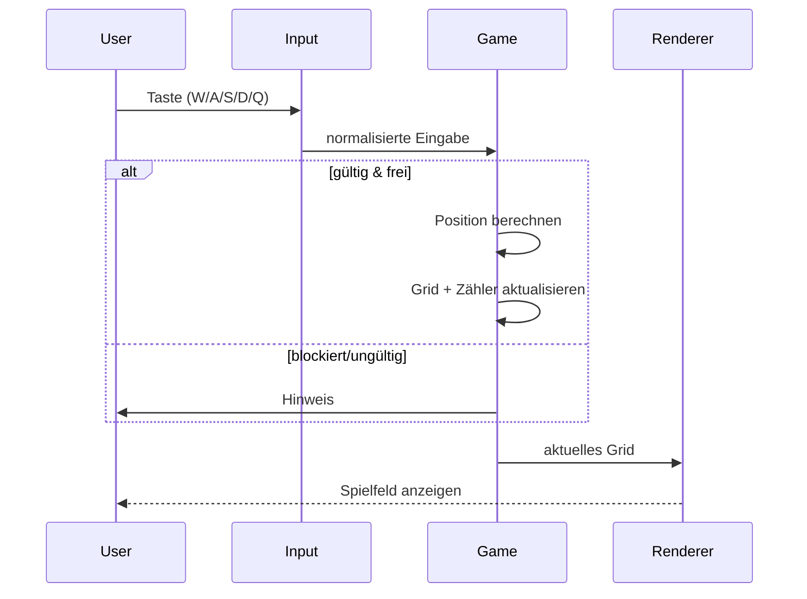

# Diagramme – Labyrinth (C)

Die folgenden Mermaid-Diagramme dokumentieren Aufbau und Ablauf des Projekts.  
GitHub rendert diese Diagramme automatisch in der Dateiansicht.

---

## 1) Modul-Überblick (Dateien & Abhängigkeiten)



**Abb. 1 – Modul-Überblick:** `main.c` spricht über `labyrinth.h` mit `labyrinth.c`; Tests hängen an der API; Nutzung von `stdlib.h/stdio.h/rand()`.

---

## 2) Datenmodell (C-Structs)



**Abb. 2 – Datenmodell:** `Game` kapselt den gesamten Spielzustand (`rows/cols/ratio/moves/grid/player/treasure`); `Pos` beschreibt Koordinaten.

---

## 3) Spielzug – Ablauf

```mermaid
flowchart TD
  A([Taste lesen (W/A/S/D/Q)]) -->|Q gedrückt| Z((Ende))
  A --> B{Eingabe gültig?}
  B -- Nein --> H[Hinweis anzeigen]
  H --> A
  B -- Ja --> C[Zielposition berechnen]
  C --> D{Innerhalb des Feldes?}
  D -- Nein --> A
  D -- Ja --> E{Zielzelle: Inhalt}
  E -- Hindernis O --> A
  E -- Schatz T --> I([Siegmeldung])
  I --> Z
  E -- Leer --> F[Spieler auf Ziel setzen]
  F --> G[Zuege++ und Grid aktualisieren]
  G --> J{Schatz gefunden?}
  J -- Ja --> I
  J -- Nein --> A
```

**Abb. 3 – Spielzug:** Eingabe prüfen → Zielposition berechnen → Kollision/Hindernis prüfen → Position/Zähler aktualisieren → Siegen oder weiterzeichnen.

---

## 4) Spielzustände – State Machine



**Abb. 4 – Zustände:** Vom Start (`Init/Generate`) in `Running`; Ende bei `Won` (Schatz) oder `Ended` (Quit).

---

## 5) Kartenerzeugung – Ablauf

```mermaid
flowchart TD
  S[Start] --> A[Grid rows×cols = '.']
  A --> B[Spieler zufällig 'P']
  B --> C[Schatz zufällig 'T' (≠ P)]
  C --> D{ratio > 0?}
  D -- nein --> F[Grid zurückgeben]
  D -- ja --> E[≈ratio Zellen zu 'O']
  E --> F[Grid zurückgeben]
  F --> G[Status = Running]
  G --> H[Ende]
```

**Abb. 5 – Kartenerzeugung:** Grid füllen, `P`/`T` platzieren, je nach `ratio` Hindernisse `O` setzen; danach Status `Running`.

---

## 6) (Optional) Sequenz – Ein Zug



**Abb. 6 – Sequenz (optional):** Interaktion von Nutzer, Eingabe, Spiel-Logik und Rendering in einem Zug.

---
