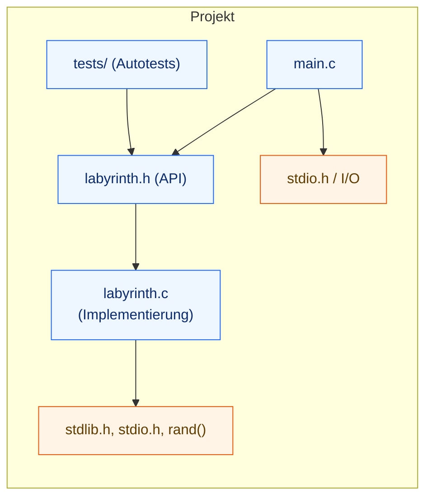
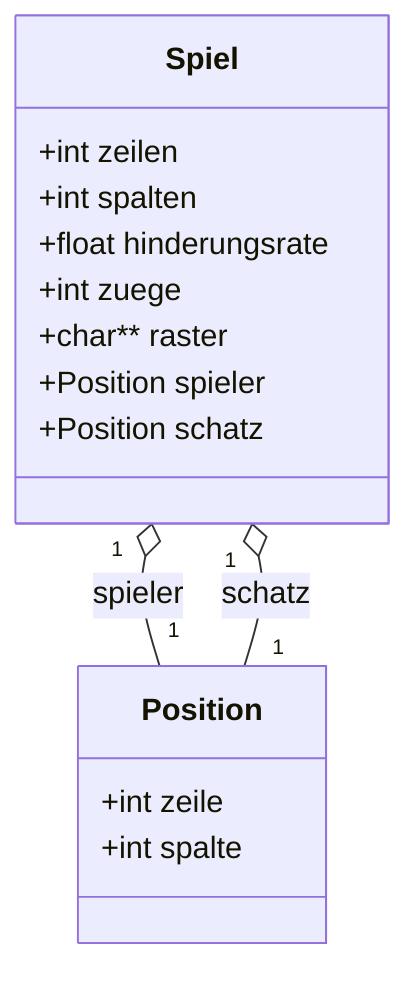
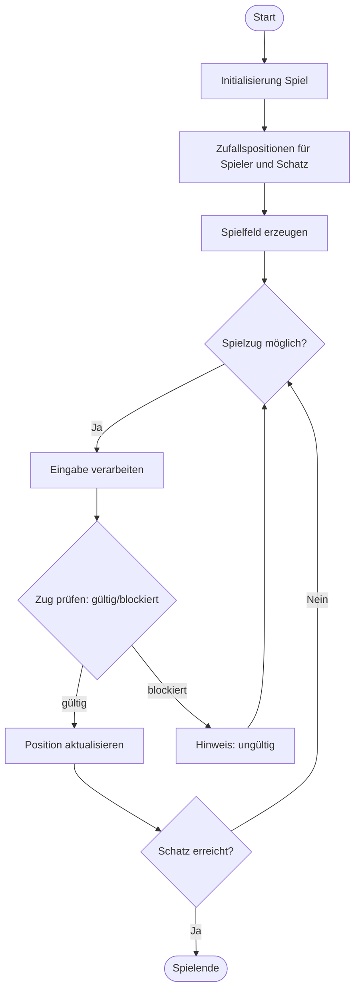
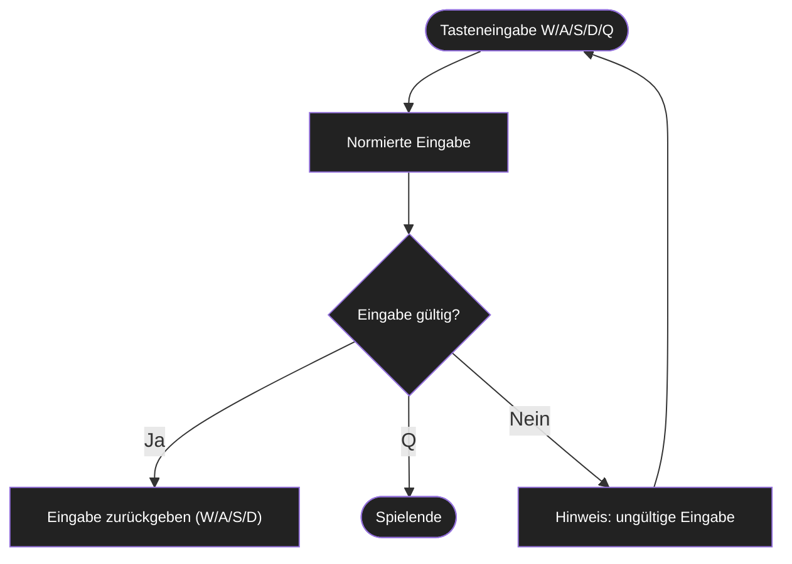
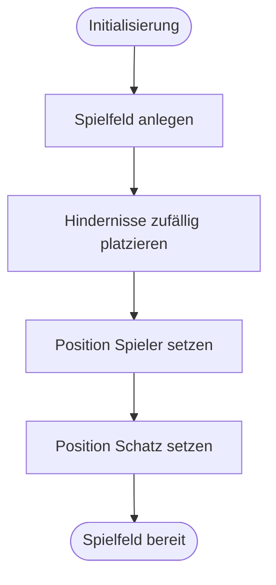
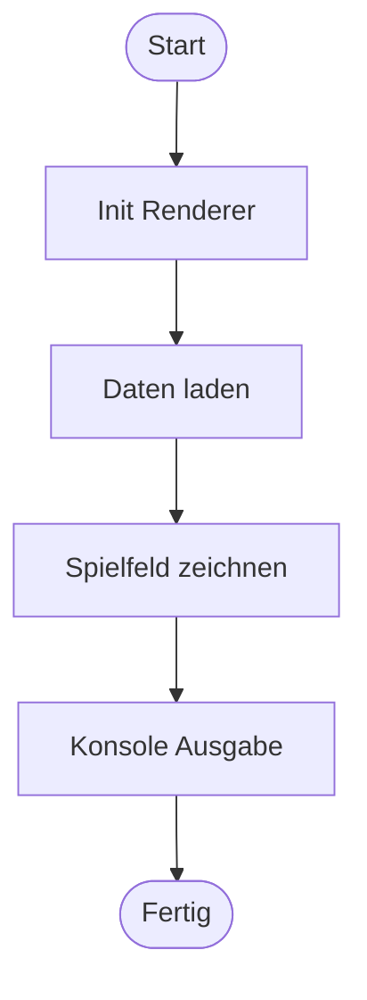
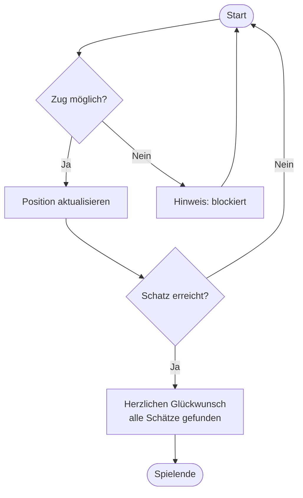

# Diagramme

In diesem Abschnitt werden alle wichtigen Diagramme zum Labyrinth-Spiel dargestellt und erklärt. Die Abbildungen sind nummeriert und inhaltlich beschrieben.
---

## Modul-Überblick (Dateien & Abhängigkeiten)

Abb. 1 – Modul-Überblick: main.c spricht via labyrinth.h mit labyrinth.c; Tests hängen an der API; Nutzung von stdlib.h/stdio.h/rand().
--- 

## Datenmodell (C-Structs)

Abb. 2 – Datenmodell: Game kapselt den Spielzustand (rows/cols/ratio/moves/grid/player/treasure). Pos beschreibt Koordinaten.
--- 

## Übersicht Spiellogik

Abb. 3 – Übersicht Spiellogik: Ablauf von Initialisierung über Spielfeld, Züge, Prüfung bis zum Spielende.
--- 

## Übersicht Eingabe

Abb. 4 – Übersicht Eingabe: Verarbeitung der Nutzereingabe.
W/A/S/D = gültige Spielzüge, Q = Spielende, ungültige Eingaben führen zu einer Wiederholung.
--- 

## Übersicht Spielfeld

Abb. 5 – Übersicht Spielfeld: Ablauf der Spielfelderstellung mit Hindernissen, Spieler- und Schatz-Position.
--- 

## Übersicht Renderer

Abb. 6 – Übersicht Renderer: Ablauf von Initialisierung über Laden der Spielfeld-Daten, Zeichnen mit Spieler/Schatz und Ausgabe auf der Konsole.
---

## Übersicht Zugauswertung

Abb. 7 – Übersicht Zugauswertung: Prüfung ob ein Zug möglich ist, Aktualisierung der Position oder Hinweis bei Blockade; Siegprüfung mit Erfolgsmeldung und Spielende.
--- 