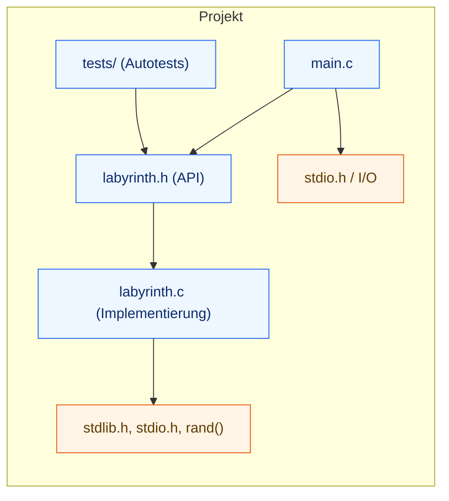
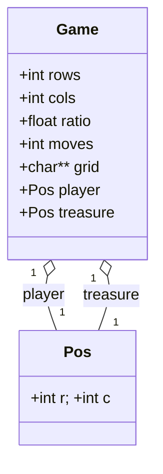
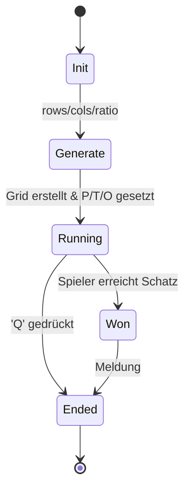
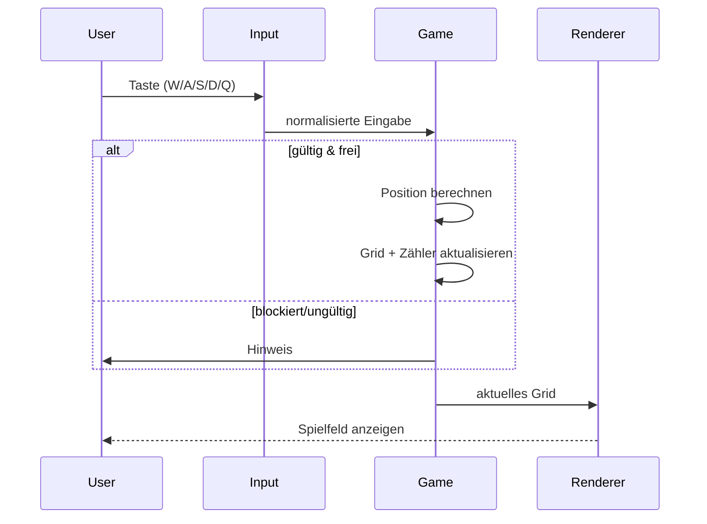

# Diagramme – Labyrinth (C)

Die folgenden Mermaid-Diagramme dokumentieren Aufbau und Ablauf des Projekts.  
GitHub rendert diese Diagramme automatisch in der Dateiansicht.

---

## 1) Modul-Überblick (Dateien & Abhängigkeiten)



**Kurz-Erklärung:** `main.c` spricht über `labyrinth.h` mit `labyrinth.c`. Tests hängen am Header → saubere Modularisierung.

---

## 2) Datenmodell (C-Structs)



**Kurz-Erklärung:** `Game` kapselt den Spielzustand, `Pos` beschreibt Koordinaten; `grid` ist die 2D-Matrix (rows×cols).

---

## 3) Spielzug – Ablauf

```mermaid
flowchart TD
  A[Start: Eingabe lesen (W/A/S/D oder Q)] -->|Q| Z[Beenden]
  A --> B{Eingabe gültig?}
  B -- nein --> M[Hinweis] --> A
  B -- ja --> C[Zielposition berechnen]
  C --> D{Innerhalb Feld?}
  D -- nein --> M2[Ignorieren] --> A
  D -- ja --> E{Zelle am Ziel?}
  E -- Hindernis 'O' --> M3[Blockiert] --> A
  E -- Schatz 'T' --> F[Spieler = Ziel setzen]
  E -- Leere '.' --> F
  F --> G[Züge++ & Grid aktualisieren]
  G --> H{Schatz gefunden?}
  H -- ja --> I[Siegmeldung → Ende]
  H -- nein --> J[Spielfeld ausgeben] --> A
  Z((Ende))
```

**Kurz-Erklärung:** Eingabe prüfen → bewegen/kollisionscheck → gewinnen oder weiterlaufen → Spielfeld neu ausgeben.

---

## 4) Spielzustände – State Machine



**Kurz-Erklärung:** Explizite Zustände dokumentieren Lebenszyklus (Start, Laufen, Gewinn, Ende).

---

## 5) Kartenerzeugung – Ablauf

```mermaid
flowchart TD
  S[Start] --> A[Grid rows×cols = '.']
  A --> B[Spieler zufällig 'P']
  B --> C[Schatz zufällig 'T' (≠ P)]
  C --> D{ratio > 0?}
  D -- nein --> F[Grid zurückgeben]
  D -- ja --> E[≈ratio Zellen zu 'O']
  E --> F[Grid zurückgeben]
  F --> G[Status = Running]
  G --> H[Ende]
```

**Kurz-Erklärung:** `ratio` steuert Hindernisdichte; Spieler/Schatz werden platziert; danach Zustand **Running**.

---

## 6) (Optional) Sequenz – Ein Zug



**Hinweis:** Sollte ein Diagramm auf GitHub nicht sofort erscheinen, die Seite kurz neu laden.
