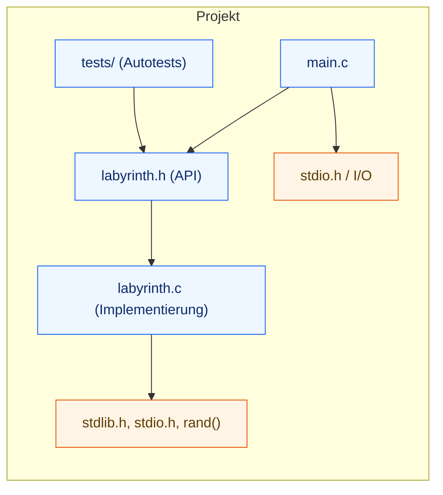
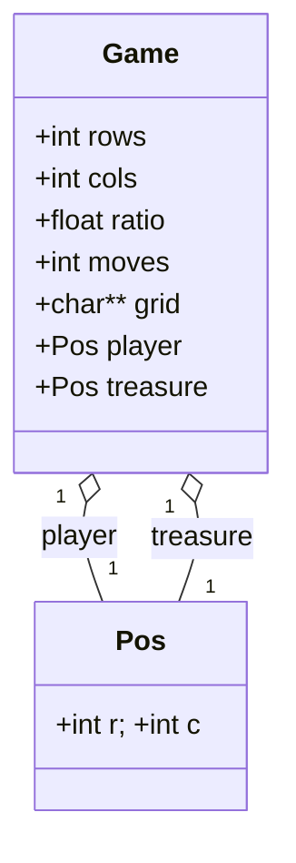
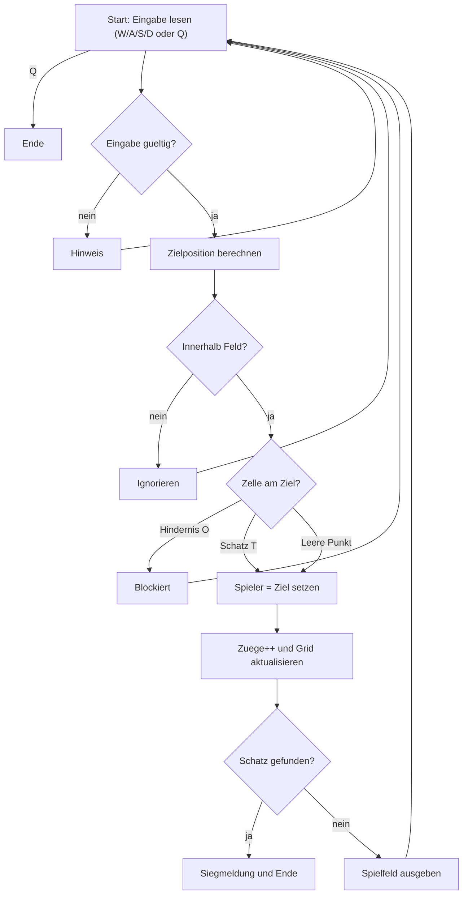
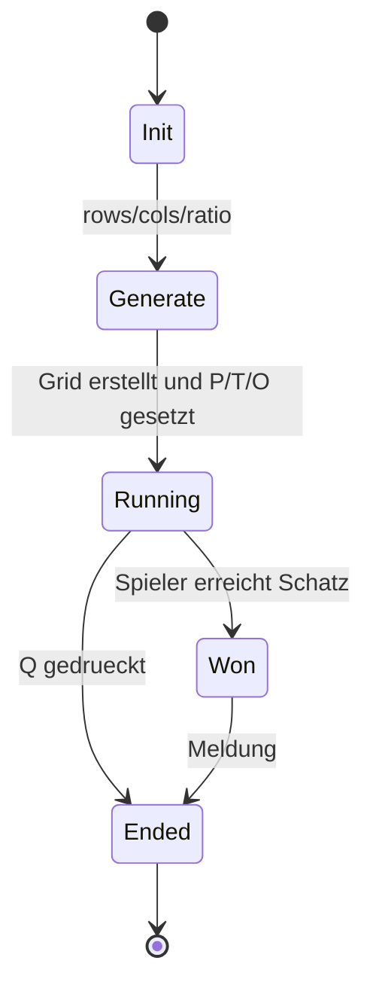
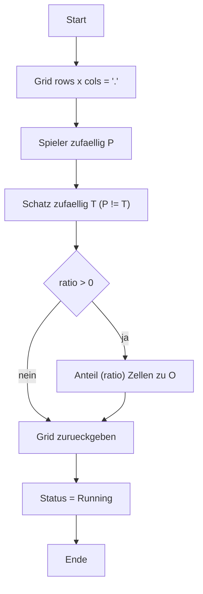
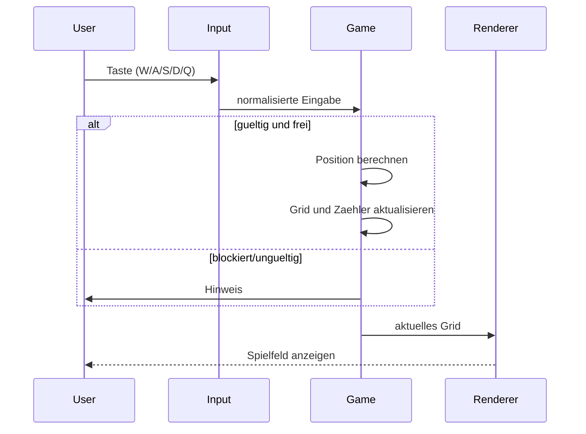

## Modul-Überblick (Dateien & Abhängigkeiten)

**Abb. 1 – Modul-Überblick:** `main.c` spricht via `labyrinth.h` mit `labyrinth.c`; Tests hängen an der API; Nutzung von `stdlib.h/stdio.h/rand()`.

---

## Datenmodell (C-Structs)

**Abb. 2 – Datenmodell:** `Game` kapselt den Spielzustand (`rows/cols/ratio/moves/grid/player/treasure`); `Pos` beschreibt Koordinaten.

---

## Spielzug – Ablauf

**Abb. 3 – Spielzug:** Eingabe pruefen → Zielposition berechnen → Kollision/Hindernis pruefen → Position/Zaehler aktualisieren → Siegen oder weiterzeichnen.

---

## Spielzustände – State Machine

**Abb. 4 – Zustände:** Vom Start (`Init/Generate`) in `Running`; Ende bei `Won` (Schatz) oder `Ended` (Quit).

---

## Kartenerzeugung – Ablauf

**Abb. 5 – Kartenerzeugung:** Grid fuellen, `P`/`T` platzieren, je nach `ratio` Hindernisse `O` setzen; danach Status `Running`.

---

## (Optional) Sequenz – Ein Zug

**Abb. 6 – Sequenz (optional):** Interaktion von Nutzer, Eingabe, Spiel-Logik und Rendering in einem Zug.
